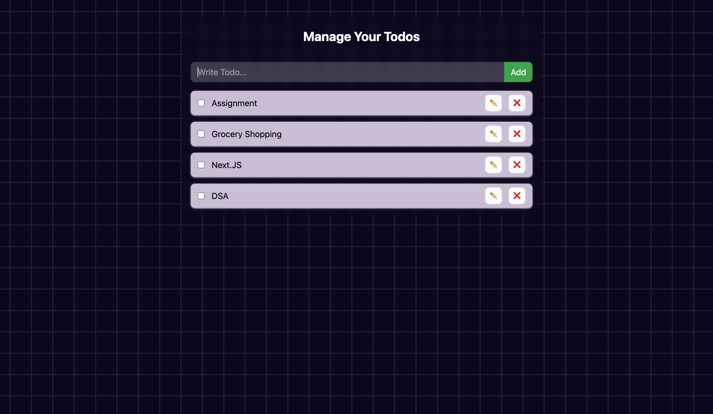

# 📝 MyTodo – Task Management App

A sleek and responsive To-Do list web application built with **React.js**, **Tailwind CSS**, and **Context API**, designed for efficient task management with persistent local storage.

## 🚀 Live Demo

👉 [todo-list-snowy-psi.vercel.app/](https://todo-list-snowy-psi.vercel.app/)

---

## 📌 Features

- ✅ Add, delete, and mark tasks as completed
- 💾 Persistent data using **localStorage**
- 🎯 Built with **React Context API** for global state management
- 📱 Fully responsive UI powered by **Tailwind CSS**
- 🌙 Clean and minimal design for enhanced usability

---

## 🛠️ Tech Stack

- **Frontend:** React.js, JavaScript, Tailwind CSS
- **State Management:** React Context API
- **Storage:** Browser LocalStorage
- **Deployment:** Vercel

---

## 🖼️ Preview



---

## 📦 Getting Started

Follow these instructions to run the project locally:

```bash
# 1. Clone the repository
git clone https://github.com/archit-tiwari-26/Todo-List.git

# 2. Navigate to the project directory
cd Todo-List

# 3. Install dependencies
npm install

# 4. Start the development server
npm run dev
